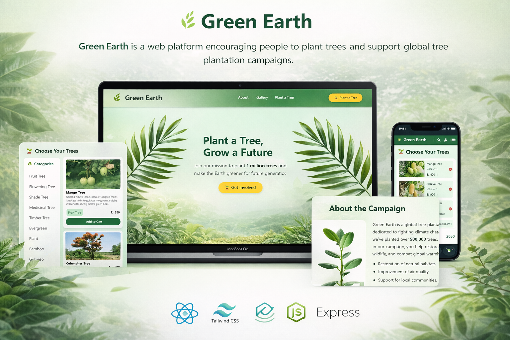

# 🌿 Green Earth – Tree Plantation Campaign Website

This project is **Assignment 006 of 13** from my web development learning journey.  
The goal of this project is to build a responsive website that promotes tree plantation and environmental awareness.

Users can explore different types of trees, view their details, and add trees to a cart to support the campaign.

---

## 🚀 Live Demo
Live Link: YOUR_DEPLOYED_URL_HERE  

---

## 📂 GitHub Repository
Repository Link: YOUR_REPO_URL_HERE  

---


# 📌 Overview


---

# 📌 Features

### 🌱 Dynamic Category Loading
Tree categories are loaded dynamically from the API and displayed on the left side.

### 🌳 Trees by Category
When a category is clicked, trees belonging to that category are displayed.

### 🪴 Tree Cards
Each tree card includes:
- Image
- Tree Name
- Short Description
- Category
- Price
- Add to Cart Button

### 🛒 Add to Cart System
Users can add trees to the cart.

### 💰 Total Price Calculation
The total price updates automatically when items are added or removed.

### ❌ Remove from Cart
Users can remove trees from the cart and the total price updates accordingly.

### 📦 Tree Details Modal
Clicking on the tree name opens a modal that shows full tree details.

### ⏳ Loading Spinner
A spinner is shown while data is loading from the API.

### 📱 Fully Responsive
The website works properly on:
- Mobile
- Tablet
- Laptop
- Desktop

---

# 🛠 Technologies Used

- **HTML**
- **Tailwind CSS**
- **DaisyUI**
- **JavaScript (Vanilla)**
- **Font Awesome**
- **REST API**

---

# 🌐 API Endpoints

### Get All Plants
```
https://openapi.programming-hero.com/api/plants
```

### Get All Categories
```
https://openapi.programming-hero.com/api/categories
```

### Get Plants by Category
```
https://openapi.programming-hero.com/api/category/{id}
```

Example:
```
https://openapi.programming-hero.com/api/category/1
```

### Get Plant Details
```
https://openapi.programming-hero.com/api/plant/{id}
```

Example:
```
https://openapi.programming-hero.com/api/plant/1
```

---

# 📖 JavaScript Questions

## 1️⃣ Difference Between `var`, `let`, and `const`

| Feature   | var      | let   | const |
| --------- | -------- | ----- | ----- |
| Scope     | Function | Block | Block |
| Reassign  | Yes      | Yes   | No    |
| Redeclare | Yes      | No    | No    |

Example:

```javascript
var a = 10
let b = 20
const c = 30
```

---

## 2️⃣ Difference Between `map()`, `forEach()`, and `filter()`

### `forEach()`
Loops through an array but does not return a new array.

```javascript
array.forEach(item => console.log(item))
```

### `map()`
Creates a new array after modifying elements.

```javascript
const numbers = [1,2,3]
const result = numbers.map(num => num * 2)
```

### `filter()`
Returns elements that match a condition.

```javascript
const result = numbers.filter(num => num > 2)
```

---

## 3️⃣ Arrow Functions in ES6

Arrow functions provide a shorter syntax for writing functions.

Example:

```javascript
const add = (a, b) => a + b
```

---

## 4️⃣ Destructuring in ES6

Destructuring allows extracting values from arrays or objects easily.

Example:

```javascript
const person = { name: "John", age: 25 }

const { name, age } = person
```

---

## 5️⃣ Template Literals

Template literals allow embedding variables inside strings using backticks.

Example:

```javascript
const name = "Green Earth"

console.log(`Welcome to ${name}`)
```

### Difference from String Concatenation

Old way:

```javascript
"Welcome to " + name
```

Modern way:

```javascript
`Welcome to ${name}`
```

Template literals are easier to read and write.

---

# 📊 Project Sections

- Navbar
- Banner
- Tree Categories
- Tree Cards
- Cart System
- About Campaign
- Impact Section
- Donation Form
- Footer

---

# 🎯 Project Goals

- Practice **API integration**
- Learn **DOM manipulation**
- Implement **dynamic UI**
- Build **responsive layouts**
- Understand **JavaScript array methods**

---
## 👨‍💻 Author


**MD Parvez Hasan**  
MERN Stack Developer

- 📧 Email: parvezyesrat17032024@gmail.com 
- 📱 Phone: +8801876097788 
- 💼 LinkedIn: www.linkedin.com/in/md-parvez-hasan-967729344  
- 🐙 GitHub:https://github.com/parety308

# 📜 License

This project is created for learning purposes.